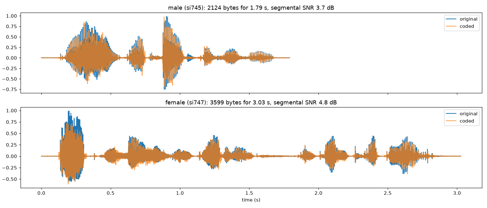
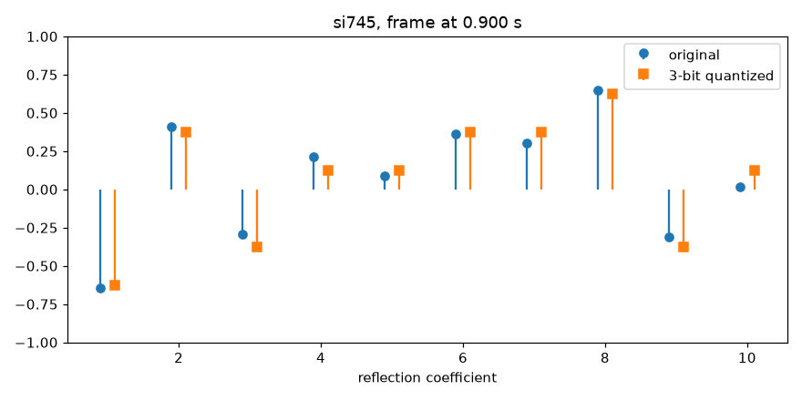

# LP speech codec

A speech codec built from scratch on **linear prediction**. It compresses 8 kHz, 16-bit speech
(128 kbit/s) to **9.44 kbit/s** (13.6× smaller) using a quantized lattice filter and a
regular-pulse excitation, in the spirit of the GSM full-rate codec.

Team project for ELEC-E5522 *Speech Processing Project* at Aalto University (spring 2025), made
with Adrián Kálazi (his alternative implementation is on the `alt-impl` branch). Test material:
20 TIMIT sentences, 10 female and 10 male speakers.



## How it works

| Step | What happens |
|---|---|
| LP analysis | Order-10 LPC per 25 ms frame (autocorrelation method, Hamming window, Levinson-Durbin). The residual is the original speech filtered with A(z), with A(z)'s memory carried across frames. |
| Filter quantization | A(z) is converted to lattice (reflection) coefficients and each is quantized with 3 bits. Cell-centre levels keep every quantized filter stable. |
| Residual coding | The residual is low-pass filtered (11-tap zero-phase FIR), normalised by its maximum (6 bits, log scale), decimated by 3 on the best of 4 grids, and the 66 remaining samples get 3 bits each. |
| Decoding | Rebuild the pulses, rebuild A(z) from the lattice indices, filter through 1/A(z) with the output memory carried across frames. |

**Bit budget per 25 ms frame:** 30 (filter) + 6 (gain) + 2 (grid) + 198 (pulses) = 236 bits → 9.44 kbit/s.
The encoder writes a real bit stream and the decoder reads it, so the rate is measured, not estimated.

| Lattice quantization | 5 bits | 4 bits | 3 bits |
|---|---|---|---|
| Average spectral distortion, si745 (male) | 0.83 dB | 1.71 dB | 2.79 dB |
| Average spectral distortion, si747 (female) | 0.82 dB | 1.72 dB | 3.03 dB |



## Usage

```bash
pip install -r requirements.txt
python -m lpcodec                    # encode + decode all 20 sentences into output/
python -m lpcodec --pulse-bits 4     # 12.08 kbit/s variant
python -m pytest tests               # unit tests
jupyter notebook speech_processing_project.ipynb
```

`output/coded/` holds the decoded sentences, `output/dcr/` the listening-test files for a
degradation category rating test (original, 0.5 s pause, coded), and `output/results.json` the
SNR and segmental SNR of every sentence.

## Layout

```
lpcodec/lp.py         autocorrelation, Levinson-Durbin, lattice <-> direct form, spectral distortion
lpcodec/filtering.py  frame-wise analysis (FIR) and synthesis (IIR) with correct filter memory
lpcodec/quantize.py   uniform and log-scale quantizers
lpcodec/codec.py      encoder / decoder / bit stream
speech_processing_project.ipynb   walkthrough of sections 3.2–3.4 with figures
drafts/               earlier milestone notebooks
```
